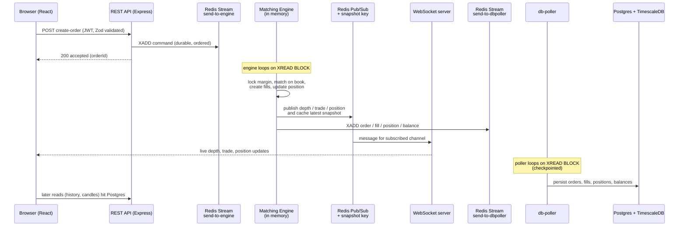

# WhiteRock, a perpetual futures exchange built from scratch

A full stack perpetual futures trading platform that models how a real derivatives exchange actually works under the hood: an in memory matching engine with price time priority, a durable order pipeline built on Redis Streams, live market data over WebSockets, and a Postgres read model that rolls trades into candlesticks with TimescaleDB.

This started as a way to really understand the machinery behind exchanges like Binance or Backpack, so most of the interesting parts (the matching engine, the order book, PnL and liquidation math, the messaging backbone) are written by hand rather than pulled from a library.

**Live demo:** https://perpetual-trading-full-stack-fronte.vercel.app/

> Heads up on the demo: the backend runs on free tier infra that suspends when idle, so the very first request wakes it up and can take a minute or two. The app shows a loading gate while that happens. It is a paper trading / testnet environment, funded with a play money faucet, no real assets involved.

## System architecture


<!-- TODO (screenshots you can add): a shot of the trading screen, and one of the order book + chart. Drop them here. -->

## What you can actually do

- Trade BTC, ETH and SOL perpetuals with market and limit orders, long or short, with leverage.
- Watch a live order book, recent trades tape, and a custom candlestick chart that you can zoom, pan and hover for OHLC.
- Open positions that track unrealised PnL against a live index price streamed from Binance, and get auto liquidated when margin runs out.
- Sign up, sign in, and manage balance through a play money faucet. There is an admin role that can create new markets.
- A built in market simulator and load test panel so the book has activity even when nobody else is trading.

## The stack, and why each piece is there

| Layer | Tech | Why this and not something else |
| --- | --- | --- |
| Monorepo | Turborepo + Bun workspaces | One repo, many small services that share types. Turbo handles task orchestration and caching. |
| Runtime | Bun, TypeScript everywhere | Fast startup and install, native TS, one language across the whole system. |
| Frontend | React 19, Vite 8, Tailwind v4 | Modern, fast dev loop. The price chart is drawn on a raw `<canvas>` with no charting library, so I control every frame. |
| REST API | Express 5, JWT, bcrypt, Zod | Familiar and boring on purpose. Zod validates every incoming payload at the edge. |
| Matching engine | Custom, `js-sdsl` structures | The core of the project. Kept in memory for speed and written from scratch to learn the mechanics. |
| Messaging | Redis Streams + Pub/Sub | Streams for durable ordered commands and events, Pub/Sub for cheap fanout of live market data. More on this below. |
| WebSocket feed | `ws` server bridging Redis Pub/Sub | Pushes depth, trades, tickers and position updates to browsers. |
| Persistence | PostgreSQL + TimescaleDB, Prisma | Postgres as the source of truth for history, Timescale continuous aggregates to turn fills into candles. |
| Price feed | Binance public WebSocket | Real index prices for mark price, PnL and liquidation. |
| Deploy | Vercel, Render / Fly, Neon, Upstash, Docker | Frontend on Vercel, everything else containerised on free tiers that suspend when idle. |

## How the pieces fit together

The system is split into small single purpose services under `apps/`, plus shared packages under `packages/`.

- **`backend`** the public REST API. Auth, order intake, and all the read endpoints for history and candles. It never touches trading state directly. When you place an order it validates it and drops a command onto a Redis Stream, then returns immediately.
- **`engine`** the brain. It reads commands off the stream, runs the matching engine against an in memory order book, updates positions, computes margin and liquidation prices, then publishes market data and emits events for persistence. It is organised as focused classes: `OrderBook`, `MatchingEngine`, `RiskManager`, `PositionManager`, `FillManager`, `LiquidationManager`, `UserManager`, and the Redis plumbing.
- **`ws`** the WebSocket server. Browsers subscribe to channels like `depth:BTCUSDT`, and this service relays the matching Redis Pub/Sub messages to them. It also replays a cached snapshot on subscribe so a fresh page load is not stuck with an empty book.
- **`db-poller`** the persistence worker. It consumes the engine's event stream and writes orders, fills, positions and balances into Postgres. It checkpoints its position so it can crash and resume without losing or double writing events.
- **`binance-ws`** a tiny bridge that subscribes to Binance trade streams for the three markets and republishes prices into Redis for the engine to consume.
- **`packages`** shared TypeScript types, the Prisma client, the Redis client factory, and lint / tsconfig presets.

## The path of an order

This is the part worth understanding, because it is where the design choices show up. Placing an order is a write, and it deliberately never blocks on the database.



A few things I want to point out in that flow:

The API and the engine talk through a Redis Stream, not a direct call. The API's only job is to validate and enqueue. That keeps the request fast and, more importantly, means a command cannot be silently lost if the engine is busy or restarting. It gets replayed from the stream.

The engine is the single writer for trading state. There is exactly one instance and it owns the order book in memory. That sidesteps a whole class of locking and race problems, and it is how real matching engines are built. The tradeoff is that it is not horizontally scaled, I cover that in limitations.

Persistence is downstream and asynchronous. The database is a projection of what the engine did, not a dependency on the hot path. Reads for history and charts come from Postgres, writes flow through the engine. It is a CQRS shaped split without the ceremony.

## How live data reaches your screen

Market data has different requirements from commands. It is high volume, transient, and lots of clients want the same thing. Losing one depth update is fine as long as the next one arrives, so Pub/Sub is the right tool. The engine publishes, the WebSocket server fans out.

The catch with Pub/Sub is late joiners. If you reload the page, you subscribe and then wait for the next change before you see anything. To fix that, the engine caches the latest depth for each market in a Redis key every time it publishes, and the WebSocket server sends that snapshot to a socket the moment it subscribes. So a reload paints the current book instantly, then live updates take over.

On the client, each data stream (order book, trades, candles, personal fills) uses the same reconciliation trick that real exchanges document: start buffering the live WebSocket messages first, fetch a snapshot that carries a sequence id, then replay only the buffered messages newer than that snapshot. No gaps, no duplicates, even across a flaky reconnect.

## Candles without a cron job

Rather than computing OHLC candles in application code, the Fills table is a TimescaleDB hypertable and candles are continuous aggregates over it (`candles_1min`, `candles_1hour`, `candles_1day`). Timescale keeps those rollups fresh on a schedule, so the chart endpoint is a cheap read from a materialised view instead of a heavy `GROUP BY` on every request.

Continuous aggregates lag slightly behind the newest fills by design, so the frontend overlays the most recent live fills on top of the last database bucket. You get correct history and a live forming candle at the same time.

## Design decisions and tradeoffs

- **Streams for commands, Pub/Sub for market data.** Commands must be durable and ordered, so they go on Redis Streams with consumer checkpoints. Market data is disposable and wants wide fanout, so it goes on Pub/Sub. Using one tool for both would either make market data unnecessarily expensive or make commands unsafe.
- **In memory order book with the right data structures.** Prices live in an ordered map so best bid and ask are cheap to find, and each price level is a linked list so orders keep first in first out time priority. That is the standard price time priority model, and it means matching is fast and fair.
- **The database is never on the trading hot path.** If Postgres is slow, trading still works. Persistence catches up from the event stream. This is the single biggest reason the design feels like a real exchange rather than a CRUD app.
- **Crash recovery through checkpoints.** The `db-poller` stores the id of the last stream message it processed in Redis, so a restart resumes exactly where it left off. The engine similarly tracks its stream offset.
- **A custom canvas chart.** The candlestick chart is hand drawn on canvas with its own zoom, pan, hover and redraw scheduling. It was more work than dropping in a library, but it keeps the bundle small and taught me a lot about rendering performance.

## Edge cases that actually bit me

- **CORS in dev vs prod.** Cross origin calls from the Vite dev server kept failing, so dev now talks to the API through a relative proxy path, and prod uses an explicit allow list plus proper preflight handling.
- **Empty order book after reload.** Solved with the Redis snapshot cache described above, so subscribers get current state immediately.
- **Chart going blank.** A stale animation frame guard could wedge the canvas after React remounted it in development. Draws are now scheduled through a single frame with proper cleanup, and the price range math ignores bad values so one malformed candle cannot blank the whole chart.
- **Cold starts on free infra.** The frontend probes a health endpoint and shows a progress gate while the suspended backend wakes up, instead of throwing errors at you.
- **Slippage and average entry.** A market order that eats several price levels produces multiple fills at different prices, and the position entry price is the weighted average of those fills, which can leave you slightly negative right after opening. That is intentional and matches how real fills work.

## Running it locally

You need Bun, plus a Postgres with the TimescaleDB extension and a Redis instance. Docker is the easiest way to get the two datastores.

```sh
# install everything across the monorepo
bun install

# set env: DATABASE_URL, REDIS_URL, USER_JWT_SECRET, ADMIN_JWT_SECRET,
# and for the frontend VITE_API_URL / VITE_WS_URL (see the .env.example files)

# apply schema and Timescale migrations
cd packages/prisma-db && bunx prisma migrate deploy && cd ../..

# run everything through Turborepo
bun run dev
```

The services also run standalone if you prefer, for example `bun apps/engine/src/index.ts`. The `deploy/start-all.sh` script shows how the backend, engine, db-poller and binance-ws are launched together.

## Deploying on close to zero budget

The whole thing is designed to sit on free tiers and cost almost nothing when idle.

- Frontend on Vercel.
- Postgres on Neon, Redis on Upstash.
- Backend, engine, db-poller and binance-ws packed into one container (`deploy/Dockerfile.api`) that runs them side by side. Because they share the machine that serves HTTP, the host can suspend the whole thing when idle and resume it on the next request.
- The WebSocket server runs as its own small container.
- Prisma migrations run on release, or on startup as a fallback for hosts without a separate release phase.

Config lives in `render.yaml` for Render and `deploy/fly.*.toml` for Fly. The obvious tradeoff of packing services onto one suspendable machine is that first request cold start of about a minute, which is a fair price for a demo that costs nothing to keep alive.

## Data model, briefly

Postgres holds Users, Markets, Orders, Fills, Positions and UserBalance through Prisma. Fills is a Timescale hypertable and feeds the candle aggregates. Money and quantities are tracked as available versus locked balance, so margin is held while an order rests and released when it fills or cancels. The engine keeps the live version of all this in memory, Postgres is the durable record.

## Honest limitations and where V2 goes

I would rather be straight about what this is not yet.

- The engine is a single instance. To scale it I would shard by market, one order book and one process per symbol, since markets do not interact. The messaging backbone already points that way.
- Recovery today leans on stream replay and snapshots. A production version would add periodic full engine snapshots so cold recovery does not depend on replaying long histories.
- Funding rate is designed on paper (the 8 hour premium mechanism) but is not fully wired end to end yet.
- There is no rate limiting or serious abuse protection on the API, it is a demo.

## Repo layout

```
apps/
  backend      REST API (Express, JWT, Zod)
  engine       matching engine, risk, positions, liquidation
  ws           WebSocket fanout server
  db-poller    stream consumer that writes to Postgres
  binance-ws   Binance price bridge
  frontend     React + Vite + Tailwind trading UI
  tests        integration and flow tests
packages/
  shared-types  types and Zod schemas shared everywhere
  prisma-db     Prisma schema, client, Timescale migrations
  redis-client  Redis connection factory + helpers
  eslint-config, typescript-config  shared presets
deploy/         Dockerfiles, Fly configs, start script
```

Tests run with Vitest via `bun run test`. There are also `scripts/` for load testing and market simulation so you can watch the engine handle a stream of orders.
