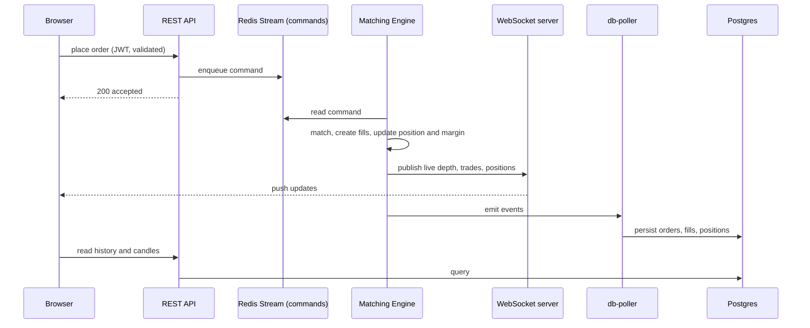

# WhiteRock

A perpetual futures exchange built from scratch: a hand written matching engine, a live order book, real time charts, and PnL with liquidations. The kind of machinery that sits under Binance or Backpack, rebuilt to actually understand it.

**Live demo:** https://perpetual-trading-full-stack-fronte.vercel.app/

> The demo runs on free infra that sleeps when idle, so the first visit takes a minute to wake up (the app shows a loading gate). It is paper trading with play money, no real assets.

<!-- TODO: add your trading UI screenshot here. Drag an image into a GitHub issue to get a user-attachments URL, then paste it below. -->

### System architecture


## The 30 second version

- A real **matching engine** with price time priority, written by hand, running the order book in memory.
- Orders flow through **Redis Streams** so nothing is lost, and the database is never on the trading hot path.
- Live depth, trades and positions pushed over **WebSockets**, with snapshots so a reload shows the book instantly.
- Candlesticks generated by **TimescaleDB** continuous aggregates, plus a custom canvas chart with zoom and pan.
- Index prices streamed from **Binance** to drive mark price, PnL and auto liquidation.
- Packed onto **free tier infra** that costs close to nothing when idle.

## How an order flows

Placing an order is a write, and it deliberately never waits on the database.



The API only validates and enqueues, then returns. The engine is the single writer and owns the book in memory. Postgres is a projection that catches up asynchronously, so trading keeps working even if the database is slow.

## Tech, and why

| Layer | Tech | Why |
| --- | --- | --- |
| Monorepo | Turborepo + Bun | Many small services sharing types, one language. |
| Frontend | React 19, Vite, Tailwind | Fast dev loop. Chart drawn on raw canvas, no chart library. |
| API | Express, JWT, Zod | Validates every payload, hands off to the engine. |
| Engine | Custom, `js-sdsl` | The core. Ordered map for prices, linked lists for FIFO time priority. |
| Messaging | Redis Streams + Pub/Sub | Streams for durable ordered commands, Pub/Sub for cheap market data fanout. |
| Data | Postgres + TimescaleDB, Prisma | Source of truth for history, continuous aggregates for candles. |
| Deploy | Vercel, Render / Fly, Neon, Upstash | Frontend on Vercel, the rest containerised and suspendable. |

## A few decisions I would call out

- **Streams for commands, Pub/Sub for market data.** Commands must be durable and ordered. Market data is disposable and wants wide fanout. Different tools for different jobs.
- **Order book in memory.** Best bid and ask are cheap to find, each price level keeps orders first in first out. Standard price time priority, and how real engines are built.
- **Snapshots for late joiners.** The latest depth is cached in Redis, so a page reload paints the current book at once instead of waiting for the next change. Each client stream also reconciles by sequence id to avoid gaps or duplicates on reconnect.
- **Candles without a cron.** Fills sit in a Timescale hypertable, and 1m / 1h / 1d candles are continuous aggregates over it, so the chart endpoint is a cheap read.
- **Crash recovery.** The `db-poller` checkpoints the last stream id it processed, so it resumes exactly where it left off after a restart.

## Edge cases handled

CORS across dev and prod, empty order book after reload, chart blanking on remount, cold start gating while the backend wakes, and slippage where a market order fills across levels and the position takes the weighted average entry.

## Run it locally

Needs Bun, a Postgres with TimescaleDB, and Redis.

```sh
bun install
# set DATABASE_URL, REDIS_URL, JWT secrets, and frontend VITE_API_URL / VITE_WS_URL (see .env.example)
cd packages/prisma-db && bunx prisma migrate deploy && cd ../..
bun run dev
```

## Known limits, and V2

The engine is a single instance today. To scale it I would shard by market, one book per symbol, since markets do not interact. Funding rate is designed on paper but not fully wired. There is no rate limiting, it is a demo.

## Repo layout

```
apps/  backend (API)  engine  ws  db-poller  binance-ws  frontend  tests
packages/  shared-types  prisma-db  redis-client  eslint-config  typescript-config
deploy/  Dockerfiles, Fly configs, start script
```
